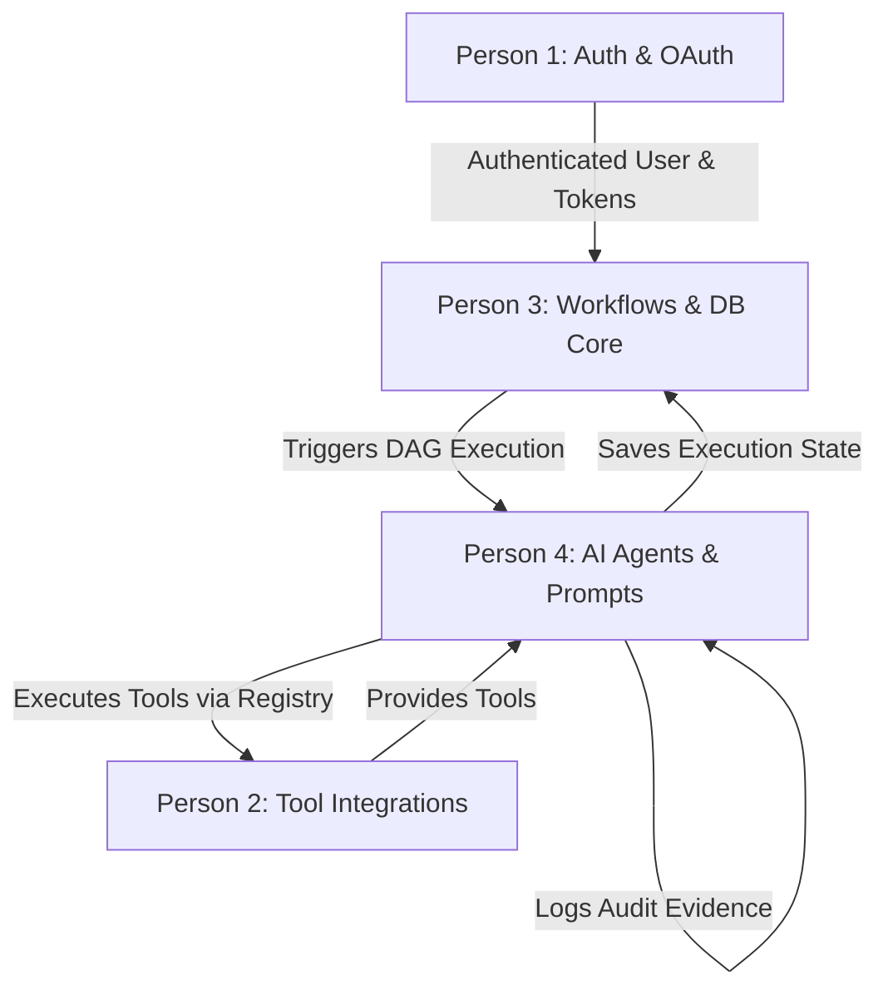

# 🚀 SMBFlow / OpsGrid — 4-Person Feature Work Distribution

This document outlines an **equal, feature-based (full-stack) work distribution** for a team of 4 developers. Every developer owns a complete, end-to-end feature slice (**User Interface + Backend API + Business/Data Logic**) so that responsibilities are clear, balanced, and easy to explain.

---

## 📊 Summary Overview of Roles

| Role | Main Ownership | Responsibilities | Key Files / Folders |
| :--- | :--- | :--- | :--- |
| **Person 1** | **Auth, Security & OAuth** | Google OAuth, Login/Signup UI, Key Vault secrets, User DB tables & permissions. | [`frontend/src/pages/SignupPage.jsx`](file:///c:/Users/lakha/ml_cp/SMBFlow/frontend/src/pages/SignupPage.jsx), [`integrations/key_vault.py`](file:///c:/Users/lakha/ml_cp/SMBFlow/integrations/key_vault.py), Auth Endpoints in [`api/main.py`](file:///c:/Users/lakha/ml_cp/SMBFlow/api/main.py) |
| **Person 2** | **Tool Integrations & APIs** | Integrations page UI, Connectors (HubSpot, Gmail, Slack, Stripe), Tool Registry. | [`integrations/connectors.py`](file:///c:/Users/lakha/ml_cp/SMBFlow/integrations/connectors.py), [`integrations/tool_registry_builder.py`](file:///c:/Users/lakha/ml_cp/SMBFlow/integrations/tool_registry_builder.py), Integrations UI |
| **Person 3** | **Workflow Engine & DB** | Workflows UI page, DAG Orchestrator, PostgreSQL schema, State Manager & signals. | [`frontend/src/pages/client/WorkflowsPage.jsx`](file:///c:/Users/lakha/ml_cp/SMBFlow/frontend/src/pages/client/WorkflowsPage.jsx), [`core/orchestrator.py`](file:///c:/Users/lakha/ml_cp/SMBFlow/core/orchestrator.py), [`core/state_manager.py`](file:///c:/Users/lakha/ml_cp/SMBFlow/core/state_manager.py), [`db/`](file:///c:/Users/lakha/ml_cp/SMBFlow/db) |
| **Person 4** | **AI Agents & Audit Trail** | Agent Activity UI, 6 AI Agents, Multi-LLM Router, Prompts & EPI Audit Logger. | [`agents/agents.py`](file:///c:/Users/lakha/ml_cp/SMBFlow/agents/agents.py), [`core/llm_router.py`](file:///c:/Users/lakha/ml_cp/SMBFlow/core/llm_router.py), [`epi/epi_manager.py`](file:///c:/Users/lakha/ml_cp/SMBFlow/epi/epi_manager.py), Prompts & DAGs |

---

## 👤 Detailed Breakdown by Person

### 1️⃣ Person 1: Authentication, Security & Google OAuth Specialist

> **Focus**: Owns user onboarding, authentication security, Google OAuth flow, and secret key storage.

#### 🎯 Key Responsibilities
* **User Interface**: Build and refine user auth pages (Login, Signup, User Profile, Security settings).
* **OAuth & API**: Implement Google OAuth login flow, JWT/Session tokens, and security endpoints.
* **Database & Key Vault**: Manage `users` table schema, role-based access control, and Azure Key Vault integration for encrypted secret storage.

#### 📁 File Ownership
* [`frontend/src/pages/SignupPage.jsx`](file:///c:/Users/lakha/ml_cp/SMBFlow/frontend/src/pages/SignupPage.jsx) *(User Signup Page)*
* [`integrations/key_vault.py`](file:///c:/Users/lakha/ml_cp/SMBFlow/integrations/key_vault.py) *(Secret & Key Vault Management)*
* [`api/main.py`](file:///c:/Users/lakha/ml_cp/SMBFlow/api/main.py) *(Auth & User Endpoints)*
* [`db/init.sql`](file:///c:/Users/lakha/ml_cp/SMBFlow/db/init.sql) *(Users & Auth Tables)*

#### 📋 Deliverables & Checklist
- [ ] Connect Google OAuth frontend button to backend auth endpoints.
- [ ] Ensure safe key fetching from Key Vault / environment variables.
- [ ] Implement session/JWT token validation middleware for API routes.
- [ ] Build user settings UI for updating credentials securely.

---

### 2️⃣ Person 2: Tool Integrations & External Services Specialist

> **Focus**: Owns connections to third-party tools (CRM, Email, Chat, Payment) and tool registry builders for agents.

#### 🎯 Key Responsibilities
* **User Interface**: Build and maintain the Integrations settings page where users connect third-party apps and enter API keys.
* **Service Connectors**: Develop and test third-party integrations (HubSpot CRM, Gmail, Slack notifications, Stripe payments).
* **Tool Registry**: Maintain the Tool Registry Builder that exposes external tools as executable functions for AI agents.

#### 📁 File Ownership
* [`integrations/connectors.py`](file:///c:/Users/lakha/ml_cp/SMBFlow/integrations/connectors.py) *(HubSpot, Gmail, Slack, Stripe APIs)*
* [`integrations/tool_registry_builder.py`](file:///c:/Users/lakha/ml_cp/SMBFlow/integrations/tool_registry_builder.py) *(Wires connectors to agent tools)*
* [`frontend/src/pages/client/`](file:///c:/Users/lakha/ml_cp/SMBFlow/frontend/src/pages/client) *(Integrations / Connected Services UI)*
* [`api/main.py`](file:///c:/Users/lakha/ml_cp/SMBFlow/api/main.py) *(Integrations & Connector endpoints)*

#### 📋 Deliverables & Checklist
- [ ] Build connected accounts UI with real-time status indicators (Connected / Disconnected).
- [ ] Test and validate HubSpot, Gmail, Slack, and Stripe API connectors.
- [ ] Add connection health-check endpoints.
- [ ] Provide clear error messages when API credentials or webhooks fail.

---

### 3️⃣ Person 3: Workflow Engine & Database Core Developer

> **Focus**: Owns the state machine, DAG workflow orchestrator engine, database migrations, and signal triggers.

#### 🎯 Key Responsibilities
* **User Interface**: Build the Workflows monitoring page, visual DAG execution tree, and execution history log viewer.
* **Core Engine**: Maintain DAG Orchestrator engine, state transitions (Pending → Running → Completed / Failed), and signal collectors.
* **Database & Seed Data**: Maintain main PostgreSQL database schema, state storage, and initial seed scripts.

#### 📁 File Ownership
* [`frontend/src/pages/client/WorkflowsPage.jsx`](file:///c:/Users/lakha/ml_cp/SMBFlow/frontend/src/pages/client/WorkflowsPage.jsx) *(Workflows Dashboard UI)*
* [`core/orchestrator.py`](file:///c:/Users/lakha/ml_cp/SMBFlow/core/orchestrator.py) *(DAG Workflow Execution Engine)*
* [`core/state_manager.py`](file:///c:/Users/lakha/ml_cp/SMBFlow/core/state_manager.py) *(PostgreSQL State Machine)*
* [`core/signal_collector.py`](file:///c:/Users/lakha/ml_cp/SMBFlow/core/signal_collector.py) *(Webhook & Polling Intake)*
* [`db/`](file:///c:/Users/lakha/ml_cp/SMBFlow/db) *(Schema, Migrations, Seed Data)*

#### 📋 Deliverables & Checklist
- [ ] Update Workflows UI to show live step-by-step DAG progress.
- [ ] Optimize PostgreSQL state table query speeds and locking mechanisms.
- [ ] Ensure DAG execution handles task failures and retry logic smoothly.
- [ ] Maintain seed scripts ([`db/seed/`](file:///c:/Users/lakha/ml_cp/SMBFlow/db/seed)) for local development testing.

---

### 4️⃣ Person 4: AI Agents, LLM Router & Audit System Specialist

> **Focus**: Owns AI agent intelligence, multi-model LLM router, prompt engineering, and audit/exception logging.

#### 🎯 Key Responsibilities
* **User Interface**: Build the Agent Control Panel, AI task monitoring views, and exception routing alerts dashboard.
* **AI & Agent Core**: Maintain all 6 AI Agents (Research → Memory), prompt templates, multi-LLM router (OpenAI/Anthropic/Gemini), and cost tracking.
* **Audit & Logs**: Manage the Evidence System (EPI recorder) for recording full agent decision chains and exception router for human escalation.

#### 📁 File Ownership
* [`agents/agents.py`](file:///c:/Users/lakha/ml_cp/SMBFlow/agents/agents.py) & [`agents/base_agent.py`](file:///c:/Users/lakha/ml_cp/SMBFlow/agents/base_agent.py) *(Agent Implementations & Loop)*
* [`core/llm_router.py`](file:///c:/Users/lakha/ml_cp/SMBFlow/core/llm_router.py) *(Multi-LLM Abstraction & Cost Tracker)*
* [`workflows/prompts/`](file:///c:/Users/lakha/ml_cp/SMBFlow/workflows/prompts) & [`workflows/dags/`](file:///c:/Users/lakha/ml_cp/SMBFlow/workflows/dags) *(Prompts & Workflow Definitions)*
* [`epi/epi_manager.py`](file:///c:/Users/lakha/ml_cp/SMBFlow/epi/epi_manager.py) *(Audit Evidence Recorder)*
* [`core/exception_router.py`](file:///c:/Users/lakha/ml_cp/SMBFlow/core/exception_router.py) *(Escalation Logic)*
* [`admin/control_panel.py`](file:///c:/Users/lakha/ml_cp/SMBFlow/admin/control_panel.py) *(Admin Terminal & Control Dashboard)*

#### 📋 Deliverables & Checklist
- [ ] Refine AI prompts to improve agent output quality and lower hallucination.
- [ ] Track LLM token usage and cost per workflow run.
- [ ] Store full audit logs (.epi evidence files) for compliance and debugging.
- [ ] Build exception routing UI for flagging workflows that need human intervention.

---

## 🔄 How the 4 Roles Work Together



1. **Person 1** logs in the user securely and provides credentials.
2. **Person 2** connects the user's tools (Slack, HubSpot, Gmail, etc.) and registers them.
3. **Person 3** receives the signal event, stores the state in DB, and starts the workflow DAG.
4. **Person 4** runs the AI agents using Person 2's tools, tracks model costs, and logs audit evidence into DB managed by Person 3.

---

## 🛠️ Quick Local Setup Checklist

To run the full stack locally:
```powershell
# 1. Run environment setup
.\setup.ps1

# 2. Launch SMBFlow backend and frontend
.\start.ps1
```

* **Frontend**: http://localhost:5173
* **Backend API Docs**: http://127.0.0.1:8000/docs
