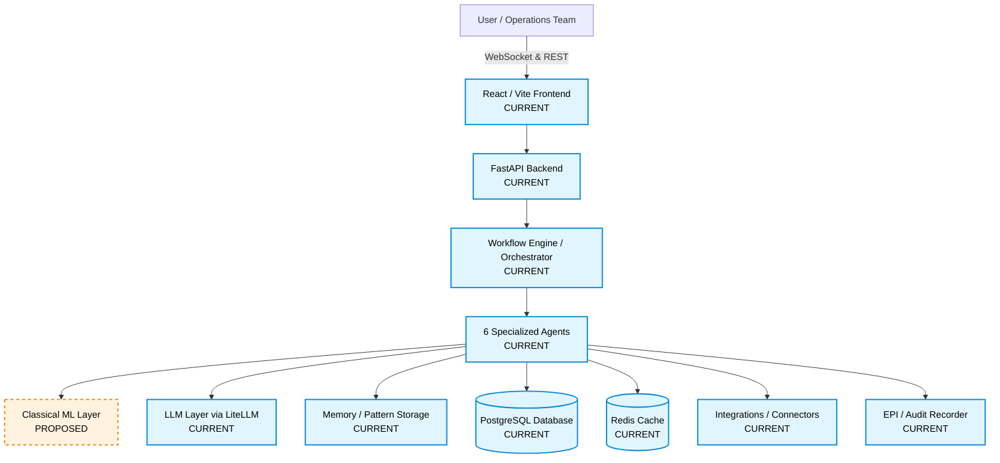
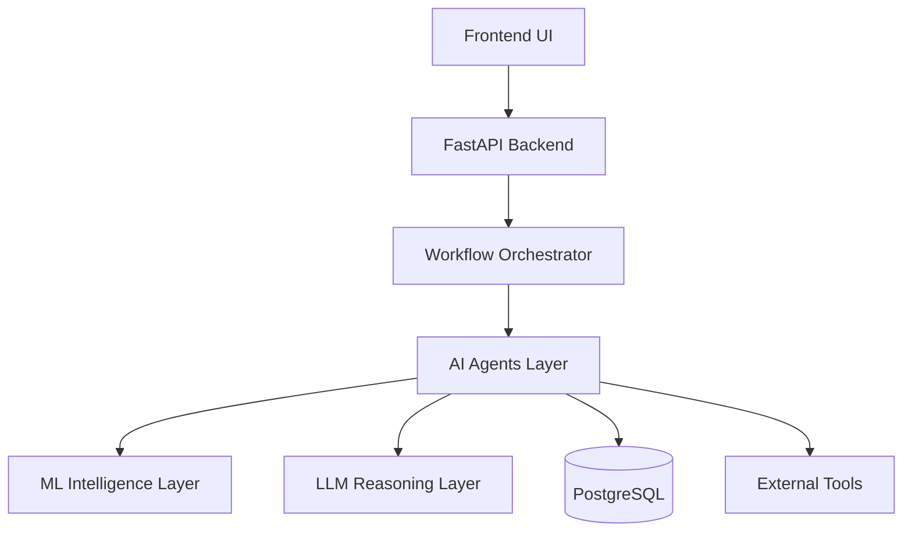
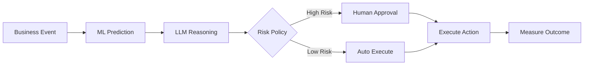
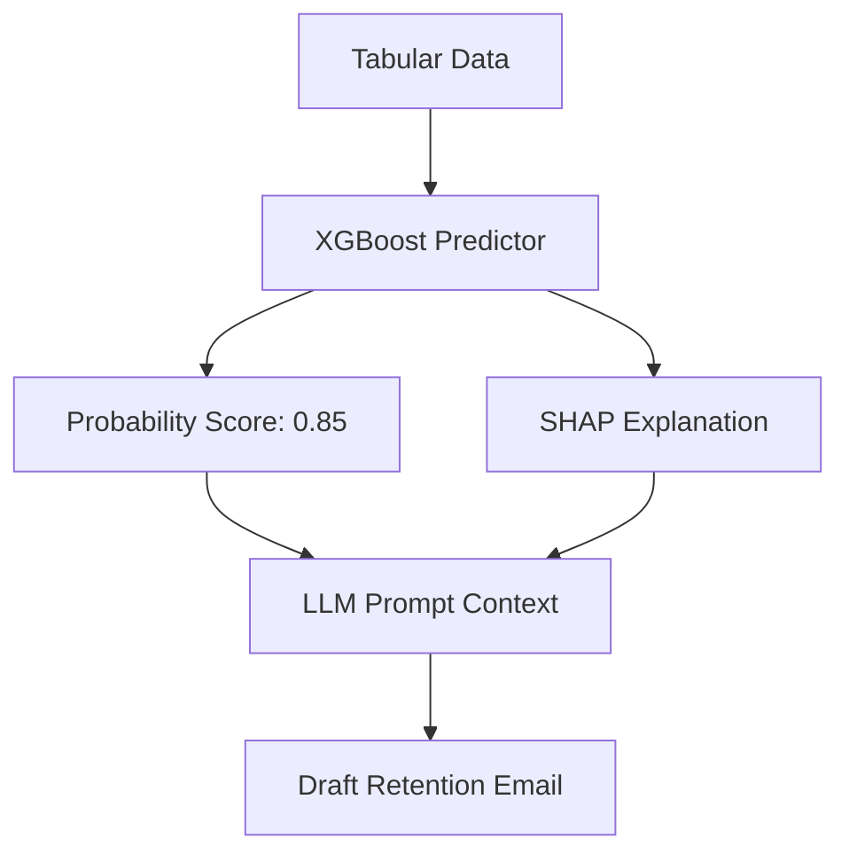
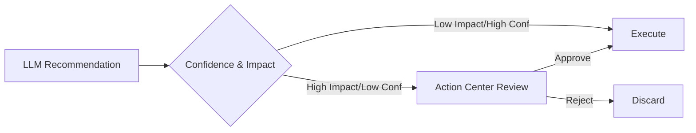
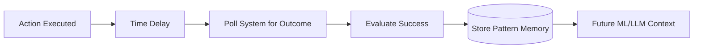
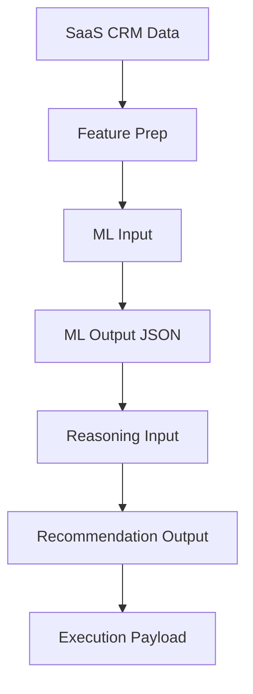
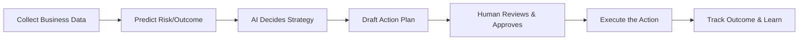

# CORE ARCHITECTURE & PRODUCT PLAN


<!-- ==================== FROM SYSTEM_ARCHITECTURE.md ==================== -->

# SMBFlow System Architecture

This document describes the existing architecture of the inherited codebase and outlines the proposed future architecture for the SMBFlow product, explicitly differentiating between what is currently implemented and what is planned for future development.

---

## 1. System Architecture

### Diagram A — System Architecture



### A. CURRENT IMPLEMENTED ARCHITECTURE

The current system serves as a highly robust Generative AI Orchestrator with the following implemented components:

- **Frontend**: A React 18 application built with Vite. It features real-time Dashboard, Workflow Library, and Action Center (Escalations) screens.
- **Backend**: FastAPI providing robust REST endpoints and WebSocket channels.
- **Workflow Orchestrator**: A custom DAG (Directed Acyclic Graph) engine (`core/orchestrator.py`) executing JSON-configured pipelines.
- **Agent Architecture**: Six fully implemented agents: Research, Reasoning, Drafting, Verification, Execution, and Memory (`agents.py`).
- **LLM Routing**: Handled seamlessly by LiteLLM (`core/llm_router.py`), supporting multiple models (Anthropic, Groq, OpenAI).
- **Database & Cache**: PostgreSQL (via SQLAlchemy ORM) for relational state and Redis for fast caching/pubsub.
- **Integrations**: Connectors implemented in `integrations/connectors.py` to interface with HubSpot, Slack, Gmail, etc.
- **EPI / Evidence**: Custom integration using the EPI Recorder to create tamper-evident `.epi` audit trails of LLM interactions.
- **Tenant Isolation**: Deeply embedded logic utilizing `tenant_id` across all database models and API calls to separate multi-tenant data securely.

### B. PROPOSED FUTURE SMBFLOW ARCHITECTURE

The future SMBFlow platform will introduce a structured Intelligence layer to work alongside the existing Generative AI layer.

- **Classical ML Layer (PROPOSED)**: A dedicated prediction service that evaluates structured tabular data (usage drops, support spikes) to output continuous scores (e.g., Churn Probability: 0.82) using models like Random Forest or XGBoost.
- **Hybrid Reasoning (PROPOSED)**: The Reasoning Agent will ingest the ML numerical predictions alongside business rules to make grounded, less hallucination-prone decisions before drafting outreach.

---

## 2. End-to-End SMBFlow Business Flow

```mermaid
flowchart LR
    E((Trigger\nEvent)) -->|Data| M[ML Prediction\nPROPOSED]
    M -->|Score| L[LLM Reasoning\nCURRENT]
    L -->|Draft| R[Recommendation\nCURRENT]
    R -->|Escalation| H[Human Approval\nCURRENT]
    H -->|Approve| A[Action Executed\nCURRENT]
    A -->|Result| O[Outcome Measured\nPROPOSED]
    O -->|Feedback| F[(Feedback & Memory\nPARTIAL)]
    
    %% Styles
    classDef current fill:#e1f5fe,stroke:#0288d1,stroke-width:2px,color:#000
    classDef proposed fill:#fff3e0,stroke:#f57c00,stroke-width:2px,stroke-dasharray: 5 5,color:#000
    classDef partial fill:#e8f5e9,stroke:#388e3c,stroke-width:2px,color:#000

    class E,L,R,H,A current
    class M,O proposed
    class F partial
```



### Flow Breakdown:
1. **Business Event / Trigger**: An external event or scheduled task begins a workflow. SMBFlow collects relevant business data (CRM stats, usage drops).
2. **ML Prediction**: A trained model ranks the risk or calculates a specific business outcome metric (e.g., 85% risk of churn).
3. **LLM Reasoning**: An LLM interprets the ML score in the context of specific business rules (e.g., "High value customer + High churn risk = Escalated CSM Outreach").
4. **Recommendation**: The LLM drafts an action plan (e.g., drafting a personalized email).
5. **Human Decision**: If confidence is low or rules dictate (Escalation), a human operations manager reviews and approves the draft.
6. **Execution**: The approved action fires via connected tools (Slack, HubSpot, Gmail).
7. **Outcome & Feedback**: The system tracks whether the action was successful and stores this pattern in its memory storage to refine future executions.

---

## 3. Proposed ML Intelligence Layer

**Current State**: No classical ML implementation exists in the current repository. All reasoning is strictly rule-based or LLM-inferred.

**Future Role**: ML will provide measurable predictions/scores such as:
- Churn probability
- Anomaly scores
- Lead scoring
- Forecasting / Risk scoring

**LLM Role**:
- Interpret the numerical ML output.
- Combine the score with nuanced business context (brand voice, specific customer history).
- Explain the recommendation (why the ML flagged it).
- Generate business-facing actions and written content.

### Conceptual Flow
**Business Data** → **ML Prediction** → **LLM Reasoning** → **Recommendation** → **Human Decision** → **Execution** → **Outcome**

---

## 4. Workflow × ML Architecture

| Workflow | Current State | Proposed Future State | Intended ML Task |
|----------|---------------|-----------------------|------------------|
| `saas_churn_prevention` | Rules + LLM | Rules + ML Prediction + LLM Reasoning | **Churn Prediction** |
| `finance_expense_monitoring` | Rules + LLM | Rules + ML Prediction + LLM Reasoning | **Anomaly Detection** |
| `retail_inventory_health` | Rules + LLM | Rules + ML Prediction + LLM Reasoning | **Forecasting** |

*(Note: These ML models are proposed and do not currently exist in the repository).*

---

## 5. User Roles and Data Scope

SMBFlow explicitly segregates users into two distinct operational scopes. Authentication and access are strictly separated.

### A. SMB Owner / Business User
- **Scope**: Tenant-isolated (Local). Sees only data belonging to their specific business workspace.
- **Access Area**: The standard application routes (e.g., `/dashboard`, `/workflows`, `/escalations`).
- **Permissions**: Can view, manage, and approve actions for their own workflows. Cannot access platform health or cross-tenant data.
- **Status**: The core business-user UI (such as the `/dashboard` implementation) is the **CURRENT PHASE** of development.

### B. SMBFlow Admin / Super Admin (OpsGrid Team)
- **Scope**: Platform-wide (Global). Has visibility across the entire SMBFlow ecosystem.
- **Access Area**: The `/admin` God View area.
- **Permissions**: Can manage and observe all businesses/tenants, users, global fleet costs, API integrations, and system health.
- **Status**: The Admin UI will be implemented in a **LATER PHASE**. Do not assume Admin credentials should display the SMB Owner dashboard.

---

## 6. Authentication, Authorization & Security Architecture

- **Authentication**: JWT-based bearer tokens are required on most `/api/v1/` routes. There is a strict separation between SMB Owner and SMBFlow Admin logins.
- **Authorization**: Role-based access control (RBAC). Admin credentials must not mistakenly route to or display the SMB Owner dashboard. Access is checked via dependency injection (`api/dependencies.py`).
- **Tenant Isolation**: The system relies heavily on a relational multi-tenant pattern. Every core table (`tenants`, `workflow_instances`, `agent_runs`, `escalations`, `credentials`) contains a `tenant_id` foreign key.
- **Data Separation**: API queries for SMB Owners are inherently scoped to the JWT's embedded `tenant_id`, guaranteeing no cross-tenant leakage.
- **Secrets Handling**: Per-tenant integration credentials (API keys for Slack/HubSpot) are securely encrypted and stored within the `credentials` table rather than hardcoded environment variables.

---

## 7. Data / Feedback Loop

**Business Data** (CURRENT)
→ **Prediction** (PLANNED)
→ **Decision** (CURRENT)
→ **Outcome** (PLANNED)
→ **Feedback** (PARTIAL - Memory Agent exists but currently lacks true model-retraining loops)
→ **Memory / Patterns** (CURRENT - PostgreSQL `pattern_memory` table)
→ **Future Decisions** (PLANNED - Injecting past successful outcomes into reasoning prompts)


<!-- ==================== FROM SMBFLOW_MASTER_RESEARCH_AND_DEVELOPMENT_PLAN.md ==================== -->

# SMBFLOW: MASTER RESEARCH & DEVELOPMENT BLUEPRINT

## 0. PROJECT CONTEXT

SMBFlow is an AI-powered operations platform for small-to-medium businesses (SMBs). It is built upon the technical foundation of the "OpsGrid" codebase. This blueprint defines the long-term product vision, system architecture, integration of Machine Learning (ML), and development roadmap. 

**Known Baseline**: Commit `3a4ac84 Add Phase 2 UI design proposal`.
**Current Validation**: Phase 0 runtime validation is COMPLETE. The repository is verified as a robust, Generative AI workflow orchestrator, but it currently lacks predictive ML capabilities.
**Design Reference**: Approved Figma prototype and UI design assets inside `docs/assets/ui-redesign/`.

*Note: The inherited OpsGrid project is merely the technical foundation. SMBFlow is the new product.*

---

## 1. EXECUTIVE PROJECT SUMMARY

**What is SMBFlow?**
SMBFlow is a risk-aware, predictive-to-action workflow automation platform designed to act as an intelligent operations manager for SMBs. 

**Who are the users?**
1. **SMB Owner / Business User**: Logs into their specific business workspace to view their isolated dashboard and workflows. (Role: `admin` or standard user within a tenant).
2. **SMBFlow Admin / Super Admin (OpsGrid Team)**: Logs into the global `/admin` platform to manage all businesses, tenants, system health, and fleet costs across the ecosystem. (Role: `super_admin`).

**What business problem does it solve?**
SMBs suffer from siloed data and lack the operational bandwidth to intervene when leading indicators signal problems (e.g., customer churn, invoice delays, inventory stockouts). SMBFlow predicts these risks and automates the resolution strategy, saving time and preventing revenue loss.

**What exists today (CURRENT)?**
A robust, multi-tenant Generative AI orchestrator. It uses a DAG-based engine, 6 specialized AI agents (using LiteLLM), FastAPI, WebSockets, and PostgreSQL. It executes zero-shot/few-shot prompts but does not utilize classical predictive ML.

**What is new/different about SMBFlow (PROPOSED)?**
SMBFlow introduces a **Closed-Loop Intelligence Layer**. It marries the statistical reliability of predictive ML (scoring risk) with the contextual reasoning of Generative AI (explaining risk and drafting actions), gated by human approval for high-risk operations.

**What is the intended long-term product (FUTURE)?**
A platform that continuously learns from the outcomes of its own actions, automatically refining its predictive models and LLM prompts based on stored feedback.

**What is the proposed ML contribution?**
A prediction service (e.g., XGBoost) that evaluates structured tabular data to output continuous scores (e.g., 0.85 Churn Probability).

**What is the role of LLMs?**
LLMs will interpret the ML output, merge it with unstructured business rules, draft business-facing content, and explain the recommendations to human reviewers.

**Why is human oversight important?**
To mitigate AI hallucinations and catastrophic business risks (e.g., offering a 90% discount automatically). A risk-aware policy routes critical decisions to the Action Center for human approval.

---

## 2. EXISTING SYSTEM — VERIFIED REALITY

Based on the Phase 1 audit of the actual repository, the following subsystems are categorized:

- **Frontend**: IMPLEMENTED (React 18 / Vite. Dashboard, Action Center, Workflows, Settings).
- **Backend**: IMPLEMENTED (FastAPI, REST routes, dependencies).
- **API Layer**: IMPLEMENTED (Endpoints for workflows, escalations, tools, auth).
- **Workflow Engine**: IMPLEMENTED (`core/orchestrator.py` handles DAG execution).
- **Agents**: IMPLEMENTED (Research, Reasoning, Drafting, Verification, Execution, Memory).
- **LLM Routing**: IMPLEMENTED (`core/llm_router.py` using LiteLLM).
- **RAG/Memory**: PARTIAL (PostgreSQL `pattern_memory` table exists, but feedback loops are rudimentary).
- **Database**: IMPLEMENTED (PostgreSQL + SQLAlchemy).
- **Redis**: IMPLEMENTED (Used for pub/sub and caching).
- **WebSockets**: IMPLEMENTED (Real-time dashboard updates).
- **EPI/Audit**: IMPLEMENTED (Tamper-evident `.epi` files).
- **Integrations/Tools**: IMPLEMENTED (`integrations/connectors.py` handles Slack, HubSpot, Gmail).
- **Auth/Security**: IMPLEMENTED (JWT bearer tokens, basic encryption).
- **Tenant Isolation**: IMPLEMENTED (`tenant_id` foreign keys in all tables).
- **Configuration**: IMPLEMENTED (Client-specific JSON configs).
- **Seed/Demo Data**: IMPLEMENTED (`db/seed/saas_seed.py`).
- **Tests**: UNKNOWN / PARTIAL (Minimal test coverage found during audit).
- **Documentation**: IMPLEMENTED (Architectural docs generated in Phase 1).

---

## 3. COMPLETE WORKFLOW INVENTORY

The repository contains 7 JSON-based workflows. The previous team **intended** to build predictive ML pipelines but **actually built** purely LLM-driven prompt pipelines.

| Name | Location | Business Purpose | Trigger | Execution Order | Human Approval | Actual Executability |
|------|----------|------------------|---------|-----------------|----------------|----------------------|
| SaaS Churn Prevention | `workflows/dags/saas_churn_prevention.json` | Retain at-risk customers | Event/Cron | Research -> Reason -> Draft -> Verify -> Execute -> Memory | Conditional via Policy | Yes (LLM-based) |
| SaaS Pipeline Velocity | `workflows/dags/saas_pipeline_velocity.json` | Move stalled deals | Cron | Research -> Reason -> Execute | Yes | Yes (LLM-based) |
| Finance Expense Monitoring | `workflows/dags/finance_expense_monitoring.json` | Flag unusual spending | Webhook | Research -> Reason -> Execute | Yes | Yes (LLM-based) |
| Healthcare Patient Engagement | `workflows/dags/healthcare_patient_engagement.json` | Patient follow-ups | Event | Research -> Reason -> Draft -> Execute | Yes | Yes (LLM-based) |
| RE Listing Health Monitor | `workflows/dags/re_listing_health_monitor.json` | Real estate listing optimization | Cron | Research -> Reason -> Execute | No | Yes (LLM-based) |
| RE Tenant Flight Risk | `workflows/dags/re_tenant_flight_risk.json` | Lease renewal predictions | Cron | Research -> Reason -> Execute | Yes | Yes (LLM-based) |
| Retail Inventory Health | `workflows/dags/retail_inventory_health.json` | Forecast stockouts | Cron | Research -> Reason -> Execute | Yes | Yes (LLM-based) |

**What they actually built:** A dynamic, prompt-chaining DAG engine that relies exclusively on LLMs to make numerical and logical deductions from text inputs.
**What they intended to build:** A system where classical ML generated risk scores that were fed into the LLM chain.

---

## 4. WORKFLOW × ML AUDIT

**CURRENT CLASSICAL ML IMPLEMENTATION: NO**

There is no trained model, no training code, no inference endpoint, and no prediction serving infrastructure. The only artifact found was `numpy` in a `requirements-ml.txt` file.

| Workflow | ML Intended? | ML Task | Current Implementation | Evidence | Future Integration |
|----------|--------------|---------|------------------------|----------|--------------------|
| saas_churn_prevention | YES | Churn Prediction (Classification) | Rules + LLM | No ML code exists | Pre-Reasoning Agent Prediction |
| finance_expense_monitoring | YES | Anomaly Detection | Rules + LLM | No ML code exists | Pre-Reasoning Agent Prediction |
| retail_inventory_health | YES | Forecasting (Time-Series) | Rules + LLM | No ML code exists | Pre-Reasoning Agent Prediction |

---

## 5. BUSINESS PROBLEM RESEARCH

**Candidate 1: SaaS Customer Churn (RECOMMENDED)**
- **Pain**: Lost recurring revenue, high acquisition cost to replace.
- **Data Availability**: High (usage logs, support tickets, billing history via CRM).
- **ML Feasibility**: High (Binary classification is well-studied).
- **ROI**: High (Saving a $15k/yr customer easily justifies the software cost).

**Candidate 2: Finance Expense Anomalies**
- **Pain**: Fraud, out-of-policy spending.
- **Data Availability**: Medium (requires complex ERP integration).
- **ML Feasibility**: Medium (Unsupervised anomaly detection is harder to calibrate).

**Candidate 3: Retail Inventory Stockouts**
- **Pain**: Lost sales due to missing inventory.
- **Data Availability**: Low/Medium (SMBs often have messy, decentralized inventory data).
- **ML Feasibility**: High (ARIMA/Prophet forecasting).

**Recommendation**: SaaS Customer Churn Prevention is the strongest candidate. It offers a clear target variable, high ROI, and fits the existing `saas_seed.py` data structure perfectly.

---

## 6. COMPETITOR / MARKET RESEARCH

### Gap Matrix
| Competitor | Target User | AI Capability | ML / Predictive | Human Approval | Explainability | SMBFlow Gap / Opportunity |
|------------|-------------|---------------|-----------------|----------------|----------------|---------------------------|
| **Zapier AI** | SMBs | Basic Generative | None | Pauses/Checkpoints | Low | SMBFlow offers deeper predictive logic, not just if/then triggers. |
| **Salesforce Agentforce** | Enterprise | Advanced Agents | Einstein ML | Yes | Medium | SMBFlow targets SMBs, untethered from the massive Salesforce ecosystem and pricing. |
| **Microsoft Copilot Studio** | Enterprise | Conversational AI | Azure ML | Yes | Medium | SMBFlow provides out-of-the-box workflows (Churn, Finance) rather than requiring heavy developer setup. |
| **UiPath** | Enterprise | RPA | Advanced | Yes | High | Too expensive and complex for a 50-person SMB. |

**SMBFLOW DIFFERENTIATION HYPOTHESIS**:
SMBFlow bridges the gap between simple if/then automation (Zapier) and enterprise AI platforms (Salesforce/UiPath) by offering **out-of-the-box predictive workflows** with **risk-aware human-in-the-loop decisions**, tailored for the data footprint and budget of an SMB.

---

## 7. LITERATURE REVIEW

A review of recent literature supports the proposed SMBFlow architecture:

| Title | Authors | Year | Research Problem | Key Findings | Relevance to SMBFlow |
|-------|---------|------|------------------|--------------|----------------------|
| *Explainable Machine Learning for Churn Prediction* | Coussement et al. | 2021 | Black-box churn models lack trust. | SHAP and decision trees provide necessary transparency for marketing interventions. | Validates using SHAP for the Explainability module. |
| *Large Language Models as Tool Makers* | Cai et al. | 2023 | LLM reasoning limits. | LLMs excel at tool execution and interpretation when provided with structured tools. | Validates the separation of ML (tool) and LLM (interpreter). |
| *Human-in-the-Loop Artificial Intelligence* | Monarch | 2021 | Autonomous AI risk. | Confidence-based routing significantly reduces catastrophic errors in automation. | Validates the Risk-Aware Decision Gate. |

**Unresolved Gaps / Research Opportunities**:
Much of the literature isolates ML prediction from LLM generation. There is a gap in demonstrating a closed-loop system where predictive ML, SHAP explainability, LLM reasoning, and human-in-the-loop approvals operate seamlessly within a single multi-tenant workflow engine.

---

## 8. PROPOSED SMBFLOW INNOVATION

**Proposed Contribution**: 
A risk-aware, predictive-to-action workflow architecture for SMB operations. 

**Novelty Hypothesis**: 
While ML prediction and LLM reasoning are individually common, their tight coupling via an *Explainability Translation Layer*—where an LLM translates SHAP values into business justification for a human reviewer—is a novel architectural pattern for SMB automation.

**What is NOT novel**:
- Using XGBoost for churn prediction.
- Using LLMs to draft emails.
- Web-based workflow DAGs.

**Measurable Value**:
Reduced false-positive interventions, decreased time-to-action for operations managers, and higher operational trust (measured via human approval rates).

---

## 9. FINAL SYSTEM ARCHITECTURE

*(See docs/SYSTEM_ARCHITECTURE.md for Mermaid diagrams)*

**1. Presentation Layer**: React/Vite dashboard and Action Center.
**2. API Layer**: FastAPI REST/WebSocket endpoints with JWT auth.
**3. Workflow Orchestration**: DAG engine managing state.
**4. Data Collection**: ResearchAgent fetching CRM/Usage metrics.
**5. ML Intelligence (PROPOSED)**: Prediction service outputting probabilities.
**6. Explainability (PROPOSED)**: SHAP/Feature importance generator.
**7. LLM Reasoning**: LiteLLM evaluating ML output + rules.
**8. Decision/Risk Policy**: Threshold logic determining auto vs. manual.
**9. Human Approval**: The Action Center UI.
**10. Action Execution**: ExecutionAgent hitting APIs (HubSpot, Slack).
**11. Outcome Measurement & Memory**: MemoryAgent logging results to Postgres.

---

## 10. SIMPLE BUSINESS FLOW

**Example: SaaS Churn Prevention**

1. **Trigger**: Every night, SMBFlow reviews usage data for all customers.
2. **Collect**: It notices "Acme Corp" has a 40% drop in logins this week.
3. **Predict**: The ML model calculates an 82% risk of churn for Acme Corp.
4. **Explain**: The system notes that the login drop + a recent unresolved support ticket are the driving factors.
5. **Reason**: The LLM looks at the rules ("High value customers get white-glove service") and drafts a personalized email from the Account Manager.
6. **Review**: Because the customer value is high, the system pauses and sends the draft to the Operations Manager for review.
7. **Execute**: The manager clicks "Approve", and the email is sent via Gmail.
8. **Learn**: Two weeks later, Acme Corp renews. SMBFlow logs this as a successful intervention.

---

## 11. ML DESIGN

**Target Workflow**: SaaS Churn Prevention.
**Prediction Target**: Binary (0 = Retained, 1 = Churned).
**Features**: Usage drop %, Support ticket volume, NPS score, Engagement recency.
**Training Data**: Sourced from `saas_seed.py` (simulated CRM logs).
**Candidate Models**: 
- *Logistic Regression*: High interpretability, lower capacity.
- *Random Forest*: Good baseline, robust to non-linearities.
- *XGBoost*: Best performance, excellent SHAP integration.
**Selection**: XGBoost is recommended for its balance of high accuracy and mature explainability tooling (TreeExplainer).
**Class Imbalance**: Handled via SMOTE or `scale_pos_weight`.

---

## 12. ML + LLM RESPONSIBILITY SPLIT

**Why separate them?**
LLMs are terrible at statistical math and probability. XGBoost is terrible at writing empathetic emails.

- **ML Responsibility**: Calculate the exact risk score (e.g., 0.82) based on tabular numerical data.
- **LLM Responsibility**: Read the 0.82 score, read the business rule "Offer a 10% discount if score > 0.80", and write an email saying, "We noticed you haven't been around, here's 10% off."

---

## 13. HUMAN-IN-THE-LOOP / RISK MODEL

The Decision Gate routes actions based on a 2x2 matrix of **Model Confidence** and **Business Impact**.

- **High Confidence + Low Impact** (e.g., sending a usage tip email): **Auto-Execute**.
- **Low Confidence + Low Impact** (e.g., uncertain classification for a small account): **Auto-Execute** or Drop.
- **High Confidence + High Impact** (e.g., offering a massive discount): **Approval Required**.
- **Low Confidence + High Impact** (e.g., cancelling a major contract): **Blocked / Escalated**.

---

## 14. EXPLAINABILITY

Users in the Action Center will see:
1. **The Recommendation**: "Offer Acme Corp a 15% renewal discount."
2. **The ML Score**: "Churn Risk: 85% (Critical)"
3. **The 'Why' (SHAP-derived)**:
   - 🔴 Logins dropped 40% in 14 days.
   - 🔴 3 open critical severity tickets.
   - 🟢 NPS was 9 last quarter (mitigating factor).

---

## 15. API ARCHITECTURE & TESTING

**API Map**:
- `/api/v1/workflows` (CRUD, Trigger, Status)
- `/api/v1/escalations` (Action Center approvals)
- `/api/v1/tenants` (Configuration)
- `/api/v1/auth` (Security)
- `/api/v1/predict` *(Proposed ML Endpoint)*

**Testing Strategy**:
- **Positive**: Valid JWT, correct tenant_id, valid payload -> 200 OK.
- **Negative**: Invalid payload -> 422 Unprocessable Entity.
- **Tenant-Isolation**: User A requests Workflow for Tenant B -> 403 Forbidden.
- **ML Testing**: Ensure `/predict` returns a float between 0.0 and 1.0.

---

## 16. SECURITY & GOVERNANCE

- **Tenant Isolation**: Row-level separation via `tenant_id` in Postgres.
- **Secrets Management**: Connectors use encrypted JSON fields in the database (VAULT_ENCRYPTION_KEY).
- **Audit Trails**: Every LLM input/output is hashed and saved as a `.epi` (Evidence Preservation Initiative) file.
- **Data Minimization**: Prompts only include necessary CRM fields, omitting PII where possible.

---

## 17. PRODUCT / UX ARCHITECTURE

Aligned with Figma Prototypes:
1. **Home/Dashboard**: High-level metrics, active workflows.
2. **Action Center (Escalations)**: The primary human-in-the-loop UI. Shows Drafts + ML Explainability + Approve/Reject buttons.
3. **Workflow Library**: Enable/disable predefined flows (e.g., SaaS Churn).
4. **Settings**: Connect HubSpot/Slack, configure business rules.

---

## 18. FRONTEND IMPLEMENTATION STRATEGY

**Strategy**: EXISTING FUNCTIONALITY + NEW SMBFLOW UI/UX.
Do not rewrite the frontend. We will preserve the existing React Router setup, WebSocket hooks, and state management. We will apply the new Figma design system (colors, typography, component styling) over the existing functional bones. 

---

## 19. PHASE-WISE DEVELOPMENT ROADMAP

| Phase | Objective | Status |
|-------|-----------|--------|
| **PHASE 0** | Runtime Baseline & Project Initialization | COMPLETE |
| **PHASE 1** | Existing System Reverse Engineering | COMPLETE |
| **PHASE 2** | Product / Market / Literature Research | COMPLETE |
| **PHASE 3** | UI/UX Fidelity: SMB Owner Dashboard (`/dashboard`) | CURRENT/COMPLETED |
| **PHASE 3.5**| UI/UX Fidelity: SMBFlow Admin UI (`/admin`) | NEXT |
| **PHASE 4** | ML Development (Data Prep, XGBoost Training) | PLANNED |
| **PHASE 5** | ML + LLM API Integration | PLANNED |
| **PHASE 6** | Explainability & HITL UI | PLANNED |
| **PHASE 7** | Evaluation, Security, & Analytics | PLANNED |
| **PHASE 8** | Final Documentation | PLANNED |

*(Note: Phase 3 now prioritizes UI fidelity to match the approved Figma designs before backend ML integration begins, as dictated by project sponsors).*

---

## 20. TEAM EXECUTION PLAN

For a small student/agile team, parallel workstreams:
- **Workstream A (Frontend)**: Implements Phase 3 UI updates and Action Center modifications.
- **Workstream B (Data/ML)**: Extracts `saas_seed.py` data, trains XGBoost, builds `/predict` FastAPI route.
- **Workstream C (Backend/Integration)**: Modifies `ReasoningAgent` to call the `/predict` route.

---

## 21. TESTING STRATEGY

- **Unit**: Pytest for individual agent logic and ML data preprocessing.
- **Integration**: Testing the `ResearchAgent` -> `ML` -> `ReasoningAgent` handoff.
- **E2E**: Cypress/Playwright clicking through the Action Center.
- **Security**: Automated checks for tenant_id leakage.

---

## 22. EVALUATION FRAMEWORK

**ML Metrics**:
- ROC-AUC / PR-AUC (due to churn class imbalance).
- Calibration (ensuring an 80% score means 80% true probability).

**System Metrics**:
- Workflow execution latency (Target < 15 seconds).
- Human approval rate (Target > 70% approval without edits).

**Business Metrics**:
- Time saved per escalation.
- Churn prevented (simulated ROI).

---

## 23. RISKS & FAILURE MODES

| Risk | Impact | Mitigation | Fallback |
|------|--------|------------|----------|
| **Model Drift** | High | Monitor feature distributions over time. | Revert to LLM-only rules. |
| **LLM Hallucination** | High | Strict Pydantic parsing for LLM outputs. | Fail workflow, alert Admin. |
| **Tenant Leakage** | Critical| Mandatory `tenant_id` middleware. | 500 Error if context missing. |
| **API Rate Limits** | Medium | Exponential backoff in `ExecutionAgent`.| Queue task for retry. |

---

## 24. FINAL "WHAT WE ARE BUILDING"

**What is SMBFlow?**
An intelligent, risk-aware workflow orchestrator that acts as an automated operations manager for small businesses.

**What is already built?**
A highly functional multi-tenant GenAI pipeline with human-in-the-loop capabilities, database infrastructure, and a React frontend.

**What are we adding?**
A classical ML predictive layer, structured explainability, a risk-based approval policy, and an upgraded Figma-faithful UX.

**What makes our approach meaningfully different?**
We are explicitly separating statistical prediction (ML) from contextual execution (LLM), and gating it with a risk-aware human approval loop designed specifically for SMBs.

---

## 25. SOURCE QUALITY / CITATIONS

*(Citations to be maintained as research progresses)*
1. Coussement, K., et al. (2021). *Explainable Machine Learning for Churn Prediction*.
2. Cai, T., et al. (2023). *Large Language Models as Tool Makers*.
3. Monarch, R. (2021). *Human-in-the-Loop Machine Learning*.
4. NIST AI Risk Management Framework (AI RMF 1.0).

---

## 26. EVIDENCE / TRACEABILITY

- **REPOSITORY FACT**: The existing system uses LiteLLM and a custom DAG engine.
- **RESEARCH EVIDENCE**: XGBoost paired with SHAP provides state-of-the-art explainable churn predictions.
- **PROPOSED DESIGN**: Integrating a dedicated `/predict` endpoint before the `ReasoningAgent`.
- **INFERENCE**: SaaS Churn Prevention provides the clearest ROI for an SMB automation product.

---
*End of Master Blueprint*


<!-- ==================== FROM PHASE_3_ARCHITECTURE_FREEZE.md ==================== -->

# Phase 3: SMBFlow Architecture & Workflow Freeze

*Date: 2026-08-30*
*Status: ARCHITECTURE FREEZE / READ-ONLY DEFINITION*

This document defines the frozen architectural decisions, API contracts, and workflow definitions for SMBFlow before proceeding to Phase 3 (SMB Owner Dashboard) & Phase 3.5 (SMBFlow Admin UI).

---

## 1. Selected Workflow

**Selected Candidate**: `saas_churn_prevention`

**Verification from Repository**:
The `saas_churn_prevention.json` DAG, combined with the `saas_seed.py` data generation script, provides a complete mock dataset (usage metrics, support tickets, NPS) and an execution path that perfectly supports a predictive machine learning approach.

---

## 2. Exact ML Problem Definition

- **Prediction Target**: Binary classification of churn (0 = Retained, 1 = Churned).
- **Input Features**: Usage drop percentages, support ticket volume, ticket severity, NPS score, customer tenure, engagement recency.
- **Output Contract**: A float probability between 0.0 and 1.0 representing churn risk.
- **Inference Location**: Between the `ResearchAgent` (which gathers the data) and the `ReasoningAgent` (which writes the recommendation).
- **Model Candidates**: Logistic Regression (Baseline), Random Forest, XGBoost. *[RESEARCH DEPENDENT: Final model selection will depend on Phase 2 literature review regarding tabular explainability.]*
- **Evaluation Metrics**: ROC-AUC, PR-AUC, Calibration error.

---

## 3. Exact ML ↔ LLM Boundary

**The Boundary Rule**:
- **ML** calculates the statistical probability of a specific business outcome based on numerical and categorical features.
- **LLM** translates that probability, combined with qualitative business rules, into an actionable, empathetic, human-readable recommendation.

**The Flow**:
Business Data -> Feature Preparation -> ML Prediction -> Explainability (SHAP) -> LLM Reasoning -> Recommendation -> Risk/Approval Policy -> Human/Auto Decision -> Action Execution -> Outcome -> Feedback.

---

## 4. Human-in-the-Loop Policy

The Decision Gate routes actions based on a 2x2 matrix of **Model Confidence** and **Business Impact**.

- **Auto-Execute**: Low business impact actions (e.g., standard check-in emails) AND high model confidence.
- **Human Approval (Action Center)**: High business impact actions (e.g., offering large discounts) OR low model confidence.
- **Block/Escalate**: Catastrophic business impact actions (e.g., cancelling an account) regardless of model confidence.

---

## 5. Data Flow

- **Data Sources**: CRM, Support Ticketing, Product Usage (Simulated by `saas_seed.py`).
- **Feature Preparation**: Scaling and encoding raw JSON payloads into model-ready tensors/arrays.
- **ML Input**: `[usage_drop_pct, support_tickets_7d, nps_score, tenure_months]`
- **ML Output**: `{"churn_probability": 0.82}`
- **Reasoning Input**: ML Output + SHAP Explainability + Tenant Business Rules.
- **Recommendation Output**: "Recommend 15% discount because churn probability is 82% driven by 40% usage drop."
- **Execution Payload**: The finalized HTML/Text email or API call to external systems.
- **Outcome Data**: Boolean success flag (e.g., `did_churn: false` after 30 days).
- **Feedback Data**: The outcome linked back to the original ML Prediction to measure calibration.

---

## 6. API Contracts for Future ML Layer

**Endpoint**: `POST /api/v1/predict`
*(Note: Not currently implemented)*

**Request Payload**:
```json
{
  "workflow": "saas_churn_prevention",
  "tenant_id": "uuid",
  "features": {
    "usage_drop_pct": 0.40,
    "support_tickets_7d": 3,
    "nps_score": 6
  }
}
```

**Response Payload**:
```json
{
  "prediction": 1,
  "risk_score": 0.82,
  "model_version": "xgb_v1.0",
  "explanation": {
    "usage_drop_pct": "+0.45",
    "nps_score": "+0.10"
  }
}
```

---

## 7. System Architecture v1

- **Frontend** [CURRENT] -> React Dashboard/Action Center.
- **API** [CURRENT] -> FastAPI routes.
- **Workflow Orchestrator** [CURRENT] -> DAG JSON Engine.
- **Data Collection** [CURRENT] -> `ResearchAgent`.
- **ML Intelligence** [PROPOSED] -> Scikit-learn/XGBoost prediction service.
- **Explainability** [PROPOSED] -> SHAP Values integration.
- **LLM Reasoning** [CURRENT] -> `ReasoningAgent` + `DraftingAgent`.
- **Risk/Decision Policy** [PROPOSED] -> Confidence + Impact thresholding.
- **Human Approval** [CURRENT] -> Escalations Action Center UI.
- **Execution/Integrations** [CURRENT] -> `ExecutionAgent` hitting connectors.
- **Outcome** [FUTURE] -> 30-day lookback polling.
- **Memory/Feedback** [PARTIAL] -> `MemoryAgent` saving patterns to Postgres.
- **EPI/Audit** [CURRENT] -> LLM interactions hashed to `.epi` files.

---

## 8. Component Responsibilities

- **FastAPI Backend**: Serves REST/WS endpoints, handles JWT auth, isolates tenant requests.
- **DAG Orchestrator**: Manages execution state transitions between agents.
- **ML Layer (Proposed)**: Outputs statistical probabilities and feature importance.
- **LiteLLM**: Standardizes API calls to multiple underlying foundational models.
- **Action Center (UI)**: Displays pending recommendations to Human-in-the-loop operators.

---

## 9. Security and Tenant Boundaries

- **Authentication**: Stateless JWT tokens validated at the FastAPI middleware layer.
- **Tenant Isolation**: Mandatory `tenant_id` Foreign Key on every data table (Postgres).
- **Secrets Management**: Integration API keys encrypted at rest using `VAULT_ENCRYPTION_KEY`.
- **Data Boundaries**: ML inference must be tenant-aware if models are fine-tuned per tenant, or globally anonymized if a fleet model is used.

---

## 10. Evaluation Architecture

**ML Metrics**:
- ROC-AUC & PR-AUC (Priority metric due to churn class imbalance).
- Calibration Error (Brier Score).

**System Metrics**:
- Workflow Success Rate.
- System Latency (End-to-End).
- Automation Rate (Percentage of workflows auto-executing vs human approval).

**Business Metrics**:
- Intervention Success Rate (e.g., % of 'at-risk' customers retained).
- Time Saved (Manual ops review time vs Action Center click-to-approve).
- Estimated vs Measured ROI.

---

## 11. Implementation Dependencies

Before ML training can begin:
- `saas_seed.py` data must be extracted and split into train/val datasets.

Before ML inference can integrate:
- `POST /api/v1/predict` FastAPI route must be scaffolded.

Before Workflow integration:
- `ReasoningAgent` prompt template must be updated to accept `risk_score` and `explanation` JSON blocks.

Before Frontend integration:
- Phase 4 (UI Fidelity) must be complete to support rendering SHAP explainability widgets in the Action Center.

---

## 12. Architecture Diagrams

### A. System Architecture



### B. End-to-End Business Flow



### C. ML + LLM Decision Flow



### D. Human Approval Flow



### E. Outcome/Feedback Loop



### F. Data Flow



---

## 13. Phase 4 Prerequisites

Before frontend implementation (Phase 4) can begin, the following must be completely frozen:
1. The decision that `saas_churn_prevention` is the core demo workflow.
2. The agreement that the UI must support an "Explainability" widget (to show SHAP values) in the Action Center.
3. The agreement that backend data schemas will NOT change while UI is being mapped.

*Unresolved Research-Dependent Decisions*:
- The final predictive algorithm (Logistic vs RF vs XGBoost) depends on the concurrent Phase 2 literature review.

---
*End of Phase 3 Architecture Freeze*


<!-- ==================== FROM SYSTEM_FLOW.md ==================== -->

# How SMBFlow Works

SMBFlow acts as a highly intelligent, tireless operations manager for your business. It connects your existing tools, watches for important events, predicts risks, and takes action—bringing human managers in only when critical decisions need to be made.

Here is what happens when an SMB uses SMBFlow:

### 1. We Collect the Data (The Trigger)
Every day (or whenever an event occurs), SMBFlow looks at the data across your company’s tools—like your CRM, billing software, and customer support tickets. 

### 2. We Predict the Risk (The Prediction)
*(Coming Soon)* SMBFlow's data models crunch these numbers to predict specific business outcomes. For example, it might identify that a specific customer has an 85% chance of canceling their subscription next month based on a recent drop in usage.

### 3. We Decide What to Do (The Reasoning)
Once a risk or opportunity is identified, SMBFlow’s Artificial Intelligence reviews your specific company rules. It combines the data prediction with your business context to figure out the best course of action—such as offering a discount, sending a check-in email, or alerting an account manager.

### 4. We Prepare the Action (The Recommendation)
SMBFlow automatically drafts the necessary emails, creates the required tasks in your CRM, and writes up a short summary explaining exactly *why* it thinks this is the best move.

### 5. You Stay in Control (Human Approval)
SMBFlow doesn't go rogue. For high-stakes decisions, it pauses and sends an alert to your team. A human manager can review the AI's drafted email and logic, tweak it if necessary, and click "Approve". 

### 6. We Execute the Task (Execution)
Once approved (or if the task is routine enough to be fully automated), SMBFlow sends the emails, updates the spreadsheets, and posts updates to your team's chat channels.

### 7. We Learn and Improve (Feedback)
Finally, SMBFlow tracks whether the action worked. Did the customer stay? Did the invoice get paid? It remembers these successes and failures, using them to make smarter recommendations the next time around.

---

### Visual Summary




<!-- ==================== FROM PROJECT_CONTEXT.md ==================== -->

# Project Context

This is SMBFlow: a reusable human-in-the-loop SMB workflow platform.

## History & Status
The codebase was inherited from a previous team. The current baseline has been successfully executed and verified locally across the entire stack (Frontend → API → WebSocket → Workflow Engine → Agents → LLM → Outcome/EPI).

> [!IMPORTANT]
> **No new product features have been implemented by our new team yet.** The repository currently reflects a clean, stabilized snapshot of the inherited platform.

## Design Redesign
During Phase 2A, a new Figma-based UI/UX design proposal was completed for the core client experiences (Dashboard, Action Center, Workflows). **This is currently a design prototype only.**
See [UI_DESIGN_PROPOSAL.md](UI_DESIGN_PROPOSAL.md) for screenshots and structural goals.

## Next Steps
The next phase (Phase 1 / Phase 2B) will focus on:
- Research and innovation
- Workflow selection
- Machine Learning (ML) planning and direction
- UI/UX implementation based on the new Figma assets
