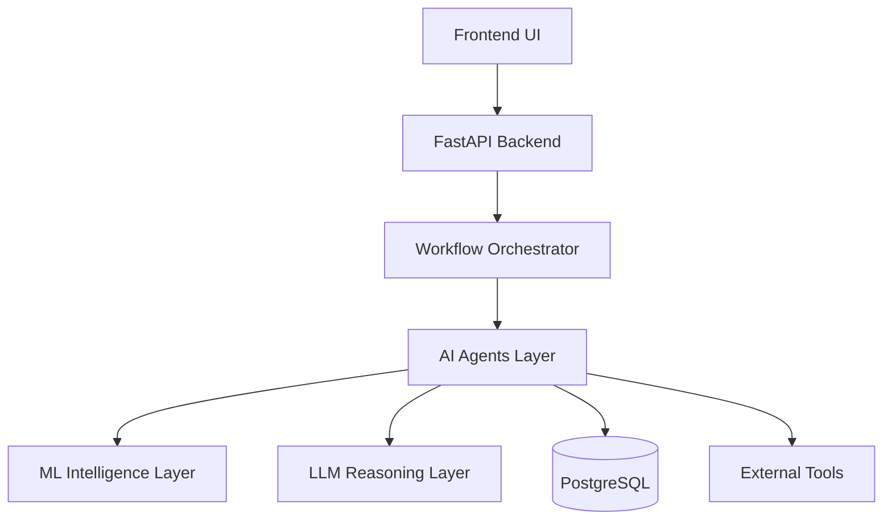
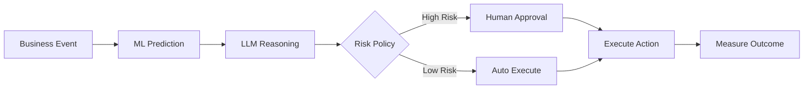
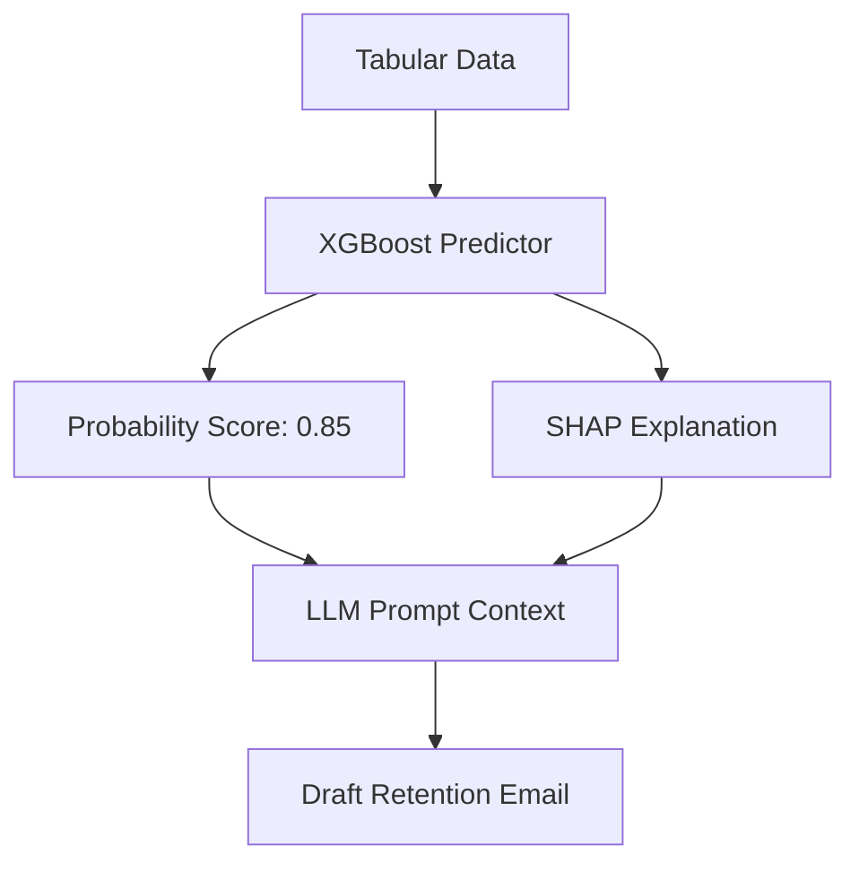
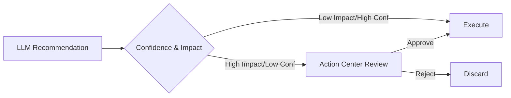
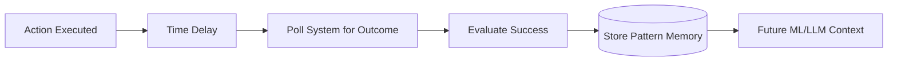
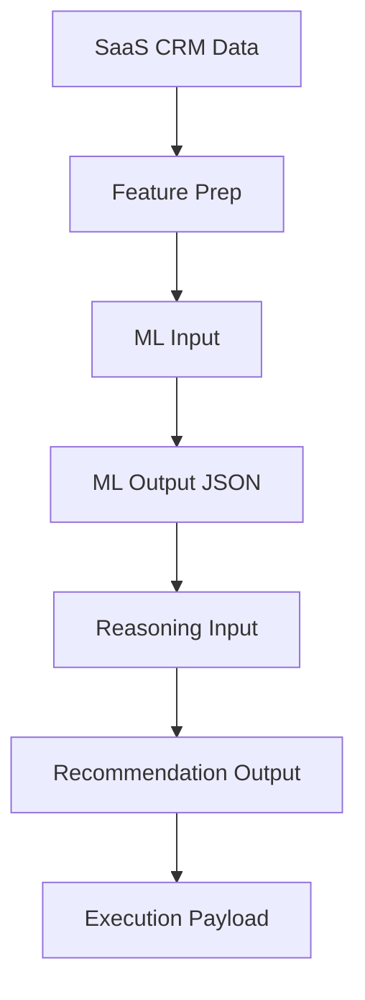

# Phase 3: SMBFlow Architecture & Workflow Freeze

*Date: 2026-08-30*
*Status: ARCHITECTURE FREEZE / READ-ONLY DEFINITION*

This document defines the frozen architectural decisions, API contracts, and workflow definitions for SMBFlow before proceeding to Phase 4 (UI/UX Implementation).

---

## 1. Selected Workflow

**Selected Candidate**: `saas_churn_prevention`

**Verification from Repository**:
The `saas_churn_prevention.json` DAG, combined with the `saas_seed.py` data generation script, provides a complete mock dataset (usage metrics, support tickets, NPS) and an execution path that perfectly supports a predictive machine learning approach.

---

## 2. Exact ML Problem Definition

- **Prediction Target**: Binary classification of churn (0 = Retained, 1 = Churned).
- **Input Features**: Usage drop percentages, support ticket volume, ticket severity, NPS score, customer tenure, engagement recency.
- **Output Contract**: A float probability between 0.0 and 1.0 representing churn risk.
- **Inference Location**: Between the `ResearchAgent` (which gathers the data) and the `ReasoningAgent` (which writes the recommendation).
- **Model Candidates**: Logistic Regression (Baseline), Random Forest, XGBoost. *[RESEARCH DEPENDENT: Final model selection will depend on Phase 2 literature review regarding tabular explainability.]*
- **Evaluation Metrics**: ROC-AUC, PR-AUC, Calibration error.

---

## 3. Exact ML ↔ LLM Boundary

**The Boundary Rule**:
- **ML** calculates the statistical probability of a specific business outcome based on numerical and categorical features.
- **LLM** translates that probability, combined with qualitative business rules, into an actionable, empathetic, human-readable recommendation.

**The Flow**:
Business Data -> Feature Preparation -> ML Prediction -> Explainability (SHAP) -> LLM Reasoning -> Recommendation -> Risk/Approval Policy -> Human/Auto Decision -> Action Execution -> Outcome -> Feedback.

---

## 4. Human-in-the-Loop Policy

The Decision Gate routes actions based on a 2x2 matrix of **Model Confidence** and **Business Impact**.

- **Auto-Execute**: Low business impact actions (e.g., standard check-in emails) AND high model confidence.
- **Human Approval (Action Center)**: High business impact actions (e.g., offering large discounts) OR low model confidence.
- **Block/Escalate**: Catastrophic business impact actions (e.g., cancelling an account) regardless of model confidence.

---

## 5. Data Flow

- **Data Sources**: CRM, Support Ticketing, Product Usage (Simulated by `saas_seed.py`).
- **Feature Preparation**: Scaling and encoding raw JSON payloads into model-ready tensors/arrays.
- **ML Input**: `[usage_drop_pct, support_tickets_7d, nps_score, tenure_months]`
- **ML Output**: `{"churn_probability": 0.82}`
- **Reasoning Input**: ML Output + SHAP Explainability + Tenant Business Rules.
- **Recommendation Output**: "Recommend 15% discount because churn probability is 82% driven by 40% usage drop."
- **Execution Payload**: The finalized HTML/Text email or API call to external systems.
- **Outcome Data**: Boolean success flag (e.g., `did_churn: false` after 30 days).
- **Feedback Data**: The outcome linked back to the original ML Prediction to measure calibration.

---

## 6. API Contracts for Future ML Layer

**Endpoint**: `POST /api/v1/predict`
*(Note: Not currently implemented)*

**Request Payload**:
```json
{
  "workflow": "saas_churn_prevention",
  "tenant_id": "uuid",
  "features": {
    "usage_drop_pct": 0.40,
    "support_tickets_7d": 3,
    "nps_score": 6
  }
}
```

**Response Payload**:
```json
{
  "prediction": 1,
  "risk_score": 0.82,
  "model_version": "xgb_v1.0",
  "explanation": {
    "usage_drop_pct": "+0.45",
    "nps_score": "+0.10"
  }
}
```

---

## 7. System Architecture v1

- **Frontend** [CURRENT] -> React Dashboard/Action Center.
- **API** [CURRENT] -> FastAPI routes.
- **Workflow Orchestrator** [CURRENT] -> DAG JSON Engine.
- **Data Collection** [CURRENT] -> `ResearchAgent`.
- **ML Intelligence** [PROPOSED] -> Scikit-learn/XGBoost prediction service.
- **Explainability** [PROPOSED] -> SHAP Values integration.
- **LLM Reasoning** [CURRENT] -> `ReasoningAgent` + `DraftingAgent`.
- **Risk/Decision Policy** [PROPOSED] -> Confidence + Impact thresholding.
- **Human Approval** [CURRENT] -> Escalations Action Center UI.
- **Execution/Integrations** [CURRENT] -> `ExecutionAgent` hitting connectors.
- **Outcome** [FUTURE] -> 30-day lookback polling.
- **Memory/Feedback** [PARTIAL] -> `MemoryAgent` saving patterns to Postgres.
- **EPI/Audit** [CURRENT] -> LLM interactions hashed to `.epi` files.

---

## 8. Component Responsibilities

- **FastAPI Backend**: Serves REST/WS endpoints, handles JWT auth, isolates tenant requests.
- **DAG Orchestrator**: Manages execution state transitions between agents.
- **ML Layer (Proposed)**: Outputs statistical probabilities and feature importance.
- **LiteLLM**: Standardizes API calls to multiple underlying foundational models.
- **Action Center (UI)**: Displays pending recommendations to Human-in-the-loop operators.

---

## 9. Security and Tenant Boundaries

- **Authentication**: Stateless JWT tokens validated at the FastAPI middleware layer.
- **Tenant Isolation**: Mandatory `tenant_id` Foreign Key on every data table (Postgres).
- **Secrets Management**: Integration API keys encrypted at rest using `VAULT_ENCRYPTION_KEY`.
- **Data Boundaries**: ML inference must be tenant-aware if models are fine-tuned per tenant, or globally anonymized if a fleet model is used.

---

## 10. Evaluation Architecture

**ML Metrics**:
- ROC-AUC & PR-AUC (Priority metric due to churn class imbalance).
- Calibration Error (Brier Score).

**System Metrics**:
- Workflow Success Rate.
- System Latency (End-to-End).
- Automation Rate (Percentage of workflows auto-executing vs human approval).

**Business Metrics**:
- Intervention Success Rate (e.g., % of 'at-risk' customers retained).
- Time Saved (Manual ops review time vs Action Center click-to-approve).
- Estimated vs Measured ROI.

---

## 11. Implementation Dependencies

Before ML training can begin:
- `saas_seed.py` data must be extracted and split into train/val datasets.

Before ML inference can integrate:
- `POST /api/v1/predict` FastAPI route must be scaffolded.

Before Workflow integration:
- `ReasoningAgent` prompt template must be updated to accept `risk_score` and `explanation` JSON blocks.

Before Frontend integration:
- Phase 4 (UI Fidelity) must be complete to support rendering SHAP explainability widgets in the Action Center.

---

## 12. Architecture Diagrams

### A. System Architecture



### B. End-to-End Business Flow



### C. ML + LLM Decision Flow



### D. Human Approval Flow



### E. Outcome/Feedback Loop



### F. Data Flow



---

## 13. Phase 4 Prerequisites

Before frontend implementation (Phase 4) can begin, the following must be completely frozen:
1. The decision that `saas_churn_prevention` is the core demo workflow.
2. The agreement that the UI must support an "Explainability" widget (to show SHAP values) in the Action Center.
3. The agreement that backend data schemas will NOT change while UI is being mapped.

*Unresolved Research-Dependent Decisions*:
- The final predictive algorithm (Logistic vs RF vs XGBoost) depends on the concurrent Phase 2 literature review.

---
*End of Phase 3 Architecture Freeze*
