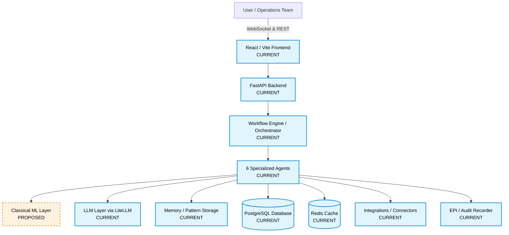

# SMBFlow System Architecture

This document describes the existing architecture of the inherited codebase and outlines the proposed future architecture for the SMBFlow product, explicitly differentiating between what is currently implemented and what is planned for future development.

---

## 1. System Architecture

### Diagram A — System Architecture

### A. CURRENT IMPLEMENTED ARCHITECTURE

The current system serves as a highly robust Generative AI Orchestrator with the following implemented components:

- **Frontend**: A React 18 application built with Vite. It features real-time Dashboard, Workflow Library, and Action Center (Escalations) screens.
- **Backend**: FastAPI providing robust REST endpoints and WebSocket channels.
- **Workflow Orchestrator**: A custom DAG (Directed Acyclic Graph) engine (`core/orchestrator.py`) executing JSON-configured pipelines.
- **Agent Architecture**: Six fully implemented agents: Research, Reasoning, Drafting, Verification, Execution, and Memory (`agents.py`).
- **LLM Routing**: Handled seamlessly by LiteLLM (`core/llm_router.py`), supporting multiple models (Anthropic, Groq, OpenAI).
- **Database & Cache**: PostgreSQL (via SQLAlchemy ORM) for relational state and Redis for fast caching/pubsub.
- **Integrations**: Connectors implemented in `integrations/connectors.py` to interface with HubSpot, Slack, Gmail, etc.
- **EPI / Evidence**: Custom integration using the EPI Recorder to create tamper-evident `.epi` audit trails of LLM interactions.
- **Tenant Isolation**: Deeply embedded logic utilizing `tenant_id` across all database models and API calls to separate multi-tenant data securely.

### B. PROPOSED FUTURE SMBFLOW ARCHITECTURE

The future SMBFlow platform will introduce a structured Intelligence layer to work alongside the existing Generative AI layer.

- **Classical ML Layer (PROPOSED)**: A dedicated prediction service that evaluates structured tabular data (usage drops, support spikes) to output continuous scores (e.g., Churn Probability: 0.82) using models like Random Forest or XGBoost.
- **Hybrid Reasoning (PROPOSED)**: The Reasoning Agent will ingest the ML numerical predictions alongside business rules to make grounded, less hallucination-prone decisions before drafting outreach.

---

## 2. End-to-End SMBFlow Business Flow

```mermaid
flowchart LR
    E((Trigger\nEvent)) -->|Data| M[ML Prediction\nPROPOSED]
    M -->|Score| L[LLM Reasoning\nCURRENT]
    L -->|Draft| R[Recommendation\nCURRENT]
    R -->|Escalation| H[Human Approval\nCURRENT]
    H -->|Approve| A[Action Executed\nCURRENT]
    A -->|Result| O[Outcome Measured\nPROPOSED]
    O -->|Feedback| F[(Feedback & Memory\nPARTIAL)]
    
    %% Styles
    classDef current fill:#e1f5fe,stroke:#0288d1,stroke-width:2px,color:#000
    classDef proposed fill:#fff3e0,stroke:#f57c00,stroke-width:2px,stroke-dasharray: 5 5,color:#000
    classDef partial fill:#e8f5e9,stroke:#388e3c,stroke-width:2px,color:#000

    class E,L,R,H,A current
    class M,O proposed
    class F partial
```

### Flow Breakdown:
1. **Business Event / Trigger**: An external event or scheduled task begins a workflow. SMBFlow collects relevant business data (CRM stats, usage drops).
2. **ML Prediction**: A trained model ranks the risk or calculates a specific business outcome metric (e.g., 85% risk of churn).
3. **LLM Reasoning**: An LLM interprets the ML score in the context of specific business rules (e.g., "High value customer + High churn risk = Escalated CSM Outreach").
4. **Recommendation**: The LLM drafts an action plan (e.g., drafting a personalized email).
5. **Human Decision**: If confidence is low or rules dictate (Escalation), a human operations manager reviews and approves the draft.
6. **Execution**: The approved action fires via connected tools (Slack, HubSpot, Gmail).
7. **Outcome & Feedback**: The system tracks whether the action was successful and stores this pattern in its memory storage to refine future executions.

---

## 3. Proposed ML Intelligence Layer

**Current State**: No classical ML implementation exists in the current repository. All reasoning is strictly rule-based or LLM-inferred.

**Future Role**: ML will provide measurable predictions/scores such as:
- Churn probability
- Anomaly scores
- Lead scoring
- Forecasting / Risk scoring

**LLM Role**:
- Interpret the numerical ML output.
- Combine the score with nuanced business context (brand voice, specific customer history).
- Explain the recommendation (why the ML flagged it).
- Generate business-facing actions and written content.

### Conceptual Flow
**Business Data** → **ML Prediction** → **LLM Reasoning** → **Recommendation** → **Human Decision** → **Execution** → **Outcome**

---

## 4. Workflow × ML Architecture

| Workflow | Current State | Proposed Future State | Intended ML Task |
|----------|---------------|-----------------------|------------------|
| `saas_churn_prevention` | Rules + LLM | Rules + ML Prediction + LLM Reasoning | **Churn Prediction** |
| `finance_expense_monitoring` | Rules + LLM | Rules + ML Prediction + LLM Reasoning | **Anomaly Detection** |
| `retail_inventory_health` | Rules + LLM | Rules + ML Prediction + LLM Reasoning | **Forecasting** |

*(Note: These ML models are proposed and do not currently exist in the repository).*

---

## 5. Tenant / Security Architecture

- **Authentication**: JWT-based bearer tokens are required on most `/api/v1/` routes.
- **Authorization**: Role-based access (e.g., super admin vs. operations manager) checked via dependency injection (`api/dependencies.py`).
- **Tenant Isolation**: The system relies heavily on a relational multi-tenant pattern. Every core table (`tenants`, `workflow_instances`, `agent_runs`, `escalations`, `credentials`) contains a `tenant_id` foreign key.
- **Data Separation**: API queries are inherently scoped to the JWT's embedded `tenant_id`, guaranteeing no cross-tenant leakage.
- **Secrets Handling**: Per-tenant integration credentials (API keys for Slack/HubSpot) are securely encrypted and stored within the `credentials` table rather than hardcoded environment variables.

---

## 6. Data / Feedback Loop

**Business Data** (CURRENT)
→ **Prediction** (PLANNED)
→ **Decision** (CURRENT)
→ **Outcome** (PLANNED)
→ **Feedback** (PARTIAL - Memory Agent exists but currently lacks true model-retraining loops)
→ **Memory / Patterns** (CURRENT - PostgreSQL `pattern_memory` table)
→ **Future Decisions** (PLANNED - Injecting past successful outcomes into reasoning prompts)
