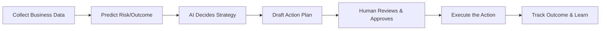

# How SMBFlow Works

SMBFlow acts as a highly intelligent, tireless operations manager for your business. It connects your existing tools, watches for important events, predicts risks, and takes action—bringing human managers in only when critical decisions need to be made.

Here is what happens when an SMB uses SMBFlow:

### 1. We Collect the Data (The Trigger)
Every day (or whenever an event occurs), SMBFlow looks at the data across your company’s tools—like your CRM, billing software, and customer support tickets. 

### 2. We Predict the Risk (The Prediction)
*(Coming Soon)* SMBFlow's data models crunch these numbers to predict specific business outcomes. For example, it might identify that a specific customer has an 85% chance of canceling their subscription next month based on a recent drop in usage.

### 3. We Decide What to Do (The Reasoning)
Once a risk or opportunity is identified, SMBFlow’s Artificial Intelligence reviews your specific company rules. It combines the data prediction with your business context to figure out the best course of action—such as offering a discount, sending a check-in email, or alerting an account manager.

### 4. We Prepare the Action (The Recommendation)
SMBFlow automatically drafts the necessary emails, creates the required tasks in your CRM, and writes up a short summary explaining exactly *why* it thinks this is the best move.

### 5. You Stay in Control (Human Approval)
SMBFlow doesn't go rogue. For high-stakes decisions, it pauses and sends an alert to your team. A human manager can review the AI's drafted email and logic, tweak it if necessary, and click "Approve". 

### 6. We Execute the Task (Execution)
Once approved (or if the task is routine enough to be fully automated), SMBFlow sends the emails, updates the spreadsheets, and posts updates to your team's chat channels.

### 7. We Learn and Improve (Feedback)
Finally, SMBFlow tracks whether the action worked. Did the customer stay? Did the invoice get paid? It remembers these successes and failures, using them to make smarter recommendations the next time around.

---

### Visual Summary

