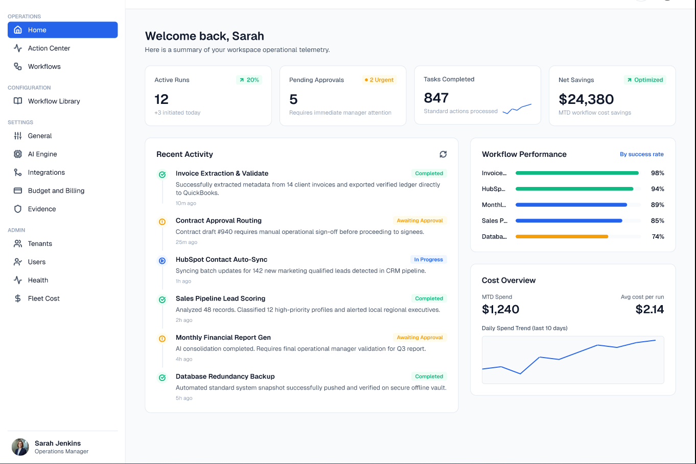
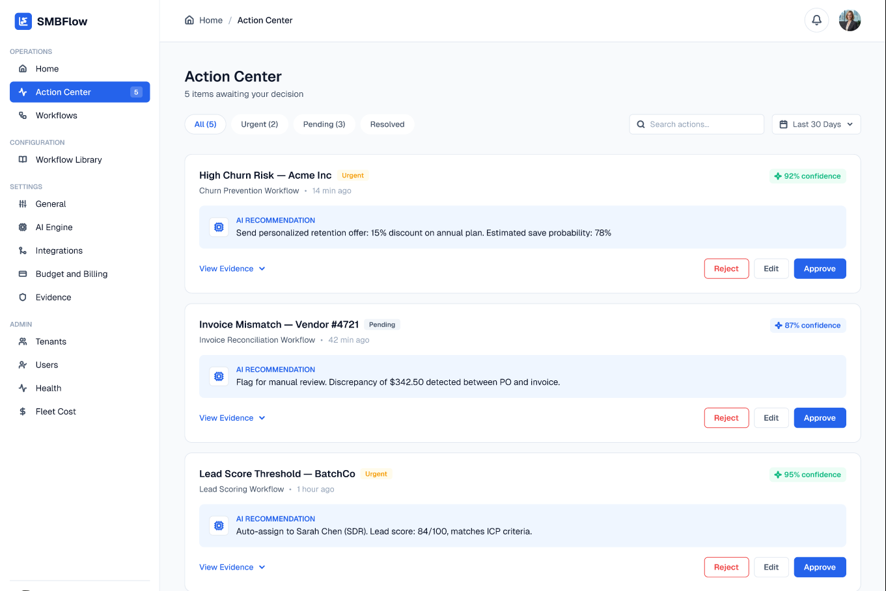
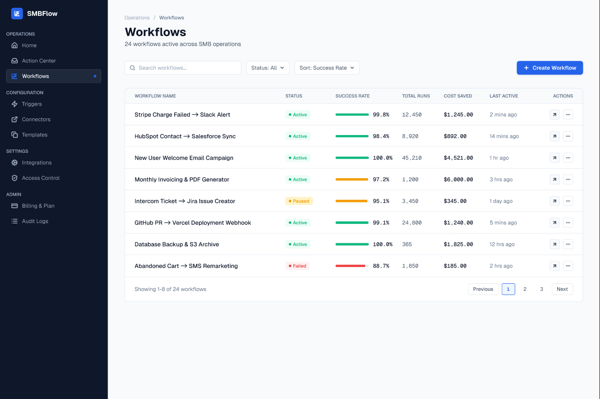
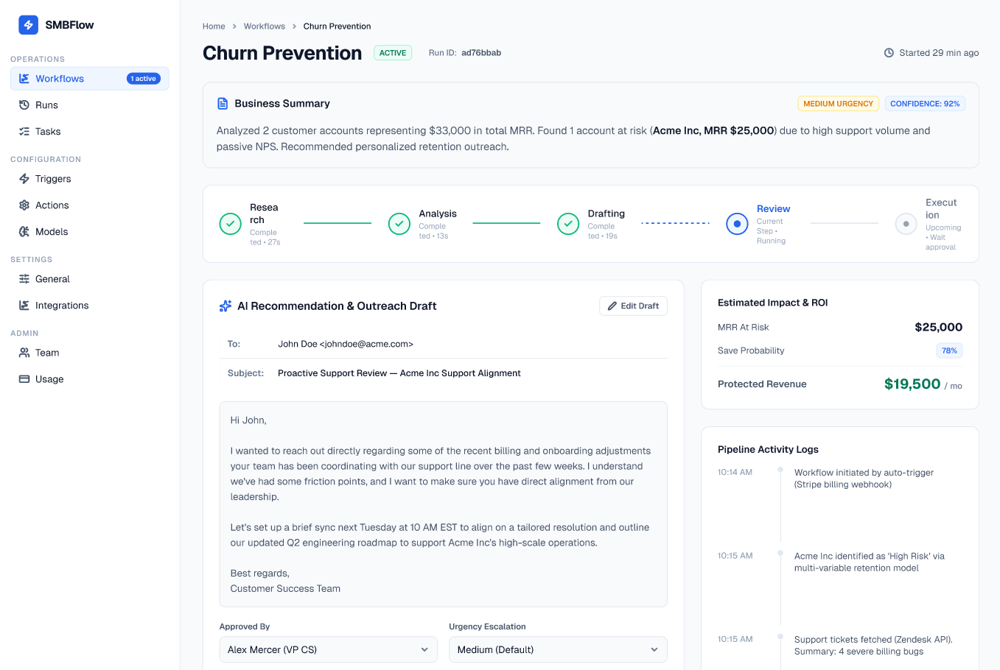
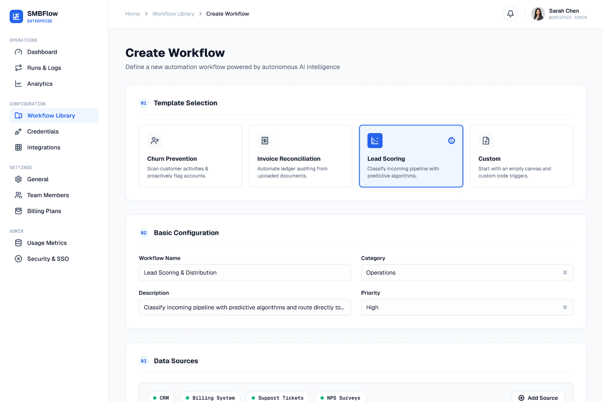
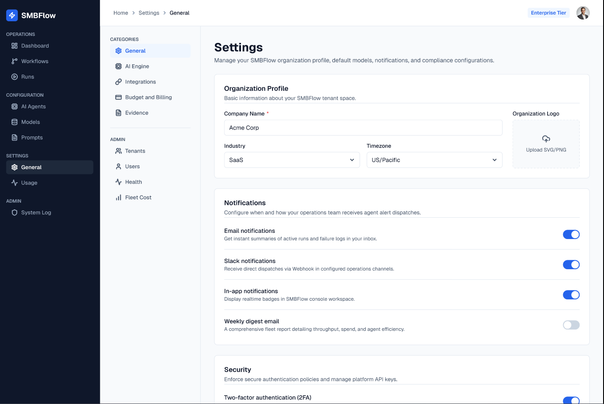

# UI Design Proposal

> [!NOTE]
> These are proposed UI/UX designs generated in Figma during Phase 2A. They have **not yet been implemented** in the React application.

## Design Goals
Our UI redesign focuses on:
- **Business-First SMB Operations UX**: Removing technical jargon and orienting the platform around business goals and results.
- **Human-in-the-Loop Action Center**: A clear, unified inbox for approving, rejecting, and editing autonomous actions safely.
- **Measurable Business Impact/ROI**: Surfacing metrics like time and money saved across the dashboard and workflows.
- **Reduced Technical Clutter**: Grouping models, API keys, and prompt engineering tools under organized settings.
- **Professional B2B SaaS Visual Language**: Moving away from noisy animations and gradients toward a high-contrast, trustworthy, data-dense interface.

---

## Current Figma Coverage

### Home Dashboard
The main entry point for the Operations Manager. It provides a high-level pulse on system health, active runs, outstanding human actions, and ROI generated by the platform.

### Action Center
The unified inbox for all Human-in-the-Loop interventions. This screen allows users to quickly review agent-generated drafts, approve API actions, and resolve escalations safely.

### Workflows
A list view of all historic and active workflow runs. It allows filtering by status and provides a quick summary of duration and cost per run.

### Workflow Detail
An audit view into a specific workflow run. It replaces the raw JSON WebSocket stream with a clean, plain-english progress pipeline showing exactly what the agents are thinking and doing.

### Workflow Analysis
*(Design planned - placeholder for deep-dive metrics)*

### Workflow Creation
The builder experience for launching a new workflow. It guides the user through selecting templates, configuring constraints, and setting a budget limit before activation.

### General Settings
A centralized hub consolidating system configuration, LLM model routing, API keys, and prompts, keeping technical details out of the core operations flow.

---

## Screens Still To Be Designed

The following screens are planned for our next design session (they are not missing implementation):
- Login / Authentication
- Workflow Library / Templates
- AI Engine Settings
- Integrations / Credentials
- Budget & Billing
- Evidence / Audit
- Tenant Management
- User / Team Management
- Fleet Cost / Platform Health
- Additional loading, empty, error and confirmation states
- Responsive/mobile layouts where useful
